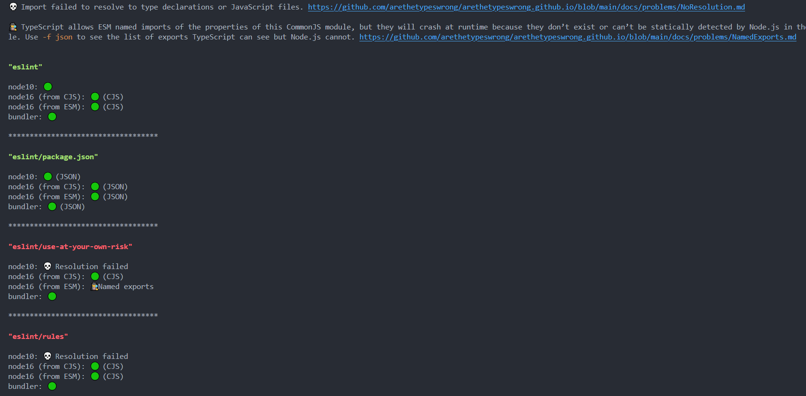

## Overview

This repository addresses issues with the current type definitions for ESLint. Below are the identified problems and their respective solutions.

## Issues and Solutions

### 1. Subpath Exports with TypeScript's [**`Node10`**](https://www.typescriptlang.org/docs/handbook/modules/reference.html#node10-formerly-known-as-node) Module Resolution

**Problem**: The subpath exports `eslint/use-at-your-own-risk` and `eslint/rules` do not work under TypeScript's [**`Node10`**](https://www.typescriptlang.org/docs/handbook/modules/reference.html#node10-formerly-known-as-node) module resolution strategy.

**Solution**: Use [**`typesVersions`**](https://github.com/andrewbranch/example-subpath-exports-ts-compat/tree/main/examples/node_modules/types-versions-wildcards) to satisfy TypeScript's [**`Node10`**](https://www.typescriptlang.org/docs/handbook/modules/reference.html#node10-formerly-known-as-node) module resolution:

```json
  "typesVersions": {
    "*": {
      "use-at-your-own-risk": [
        "./lib/types/use-at-your-own-risk.d.ts"
      ],
      "rules": [
        "./lib/types/rules/index.d.ts"
      ]
    }
  },
```

### 2. Mismatch in Named Exports with TypeScript's [**`Node16`**](https://www.typescriptlang.org/docs/handbook/modules/reference.html#node16-nodenext-1) ESM Module Resolution

**Problem**: There is a mismatch between the named exports in `eslint/use-at-your-own-risk` during runtime and the type definitions under TypeScript's [**`Node16`**](https://www.typescriptlang.org/docs/handbook/modules/reference.html#node16-nodenext-1) ESM module resolution strategy. The type definitions indicate the following named exports:

```ts
{
  FileEnumerator, FlatESLint, LegacyESLint, builtinRules, shouldUseFlatConfig
}
```

But if we try to import these named exports in an ESM file, we learn that only `builtinRules` is available.

**Solution**: We can do change the exports in `lib/unsupported-api.js` from:

```js
module.exports = {
  builtinRules: require('./rules'),
  FlatESLint,
  shouldUseFlatConfig,
  FileEnumerator,
  LegacyESLint,
}
```

to:

```js
const builtinRules = require('./rules')

module.exports = {
  builtinRules,
  FlatESLint,
  shouldUseFlatConfig,
  FileEnumerator,
  LegacyESLint,
}
```

<details>

  <summary>
  View Diff
  </summary>

```diff
 /**
  * @fileoverview APIs that are not officially supported by ESLint.
  *      These APIs may change or be removed at any time. Use at your
  *      own risk.
  * @author Nicholas C. Zakas
  */

 "use strict";

 //-----------------------------------------------------------------------------
 // Requirements
 //-----------------------------------------------------------------------------

 const { FileEnumerator } = require("./cli-engine/file-enumerator");
 const { ESLint: FlatESLint, shouldUseFlatConfig } = require("./eslint/eslint");
 const { LegacyESLint } = require("./eslint/legacy-eslint");
+const builtinRules = require("./rules");

 //-----------------------------------------------------------------------------
 // Exports
 //-----------------------------------------------------------------------------

 module.exports = {
-    builtinRules: require("./rules"),
+    builtinRules,
     FlatESLint,
     shouldUseFlatConfig,
     FileEnumerator,
     LegacyESLint
 };

```

</details>

<details>

  <summary><b>Note</b></summary>

You can test for these by following the [Reproduction Steps](#reproduction-steps) running `yarn test`. This also becomes apparent if you run [**Are The Types Wrong**](https://github.com/arethetypeswrong/arethetypeswrong.github.io):

```bash
npx @arethetypeswrong/cli@latest --from-npm eslint
```

Here is a before and after:

#### **Before:**



#### **After:**


</details>

## Reproduction Steps

1. Clone this repository.
2. Run `yarn install`.
3. Run `yarn test`.
