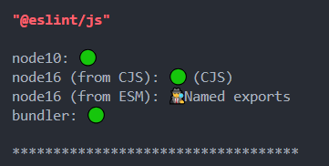
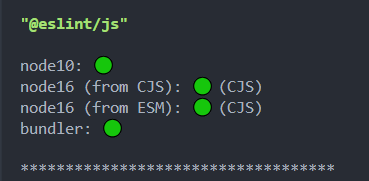

## Overview

This repository addresses issues with the current type definitions for `@eslint/js`. Below are the identified problems and their respective solutions.

## Issues and Solutions

### Mismatch in Named Exports with TypeScript's [**`Node16`**](https://www.typescriptlang.org/docs/handbook/modules/reference.html#node16-nodenext-1) ESM Module Resolution

**Problem**: There is a mismatch between the named exports in `@eslint/js` during runtime and the type definitions under TypeScript's [**`Node16`**](https://www.typescriptlang.org/docs/handbook/modules/reference.html#node16-nodenext-1) ESM module resolution strategy. The type definitions indicate the following named exports:

```ts
{
  configs, meta
}
```

But if we try to import these named exports in an ESM file, we learn that they are not available.

**Solution**: We can do change the exports in `src/index.js` from:

```js
module.exports = {
  meta: {
    name: '@eslint/js',
    version,
  },
  configs: {
    all: require('./configs/eslint-all'),
    recommended: require('./configs/eslint-recommended'),
  },
}
```

to:

```js
const all = require('./configs/eslint-all')
const recommended = require('./configs/eslint-recommended')

const configs = {
  all,
  recommended,
}

const meta = {
  name: '@eslint/js',
  version,
}

module.exports = {
  meta,
  configs,
}
```

<details>

  <summary>
  View Diff
  </summary>

```diff
 /**
  * @fileoverview Main package entrypoint.
  * @author Nicholas C. Zakas
  */

 "use strict";

 const { version } = require("../package.json");

 //------------------------------------------------------------------------------
 // Public Interface
 //------------------------------------------------------------------------------

+const all = require("./configs/eslint-all");
+const recommended = require("./configs/eslint-recommended");
+
+const configs = {
+    all,
+    recommended
+};
+
+const meta = {
+    name: "@eslint/js",
+    version
+};
+
 module.exports = {
-    meta: {
-        name: "@eslint/js",
-        version
-    },
-    configs: {
-        all: require("./configs/eslint-all"),
-        recommended: require("./configs/eslint-recommended")
-    }
+    meta,
+    configs
 };
```

</details>

<details>

  <summary><b>Note</b></summary>

You can test for these by following the [Reproduction Steps](#reproduction-steps) running `yarn test`. This also becomes apparent if you run [**Are The Types Wrong**](https://github.com/arethetypeswrong/arethetypeswrong.github.io):

```bash
npx @arethetypeswrong/cli@latest --from-npm @eslint/js
```

Here is a before and after:

#### **Before:**



#### **After:**



</details>

## Reproduction Steps

1. Clone this repository.
2. Run `yarn install`.
3. Run `yarn test`.
